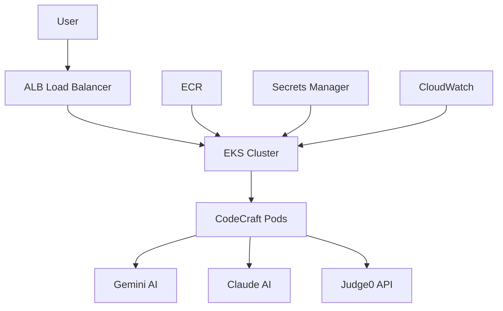

# 🚀 CodeCraft AI Assistant (Agents) - EKS Deployment
**Production-ready multimodal AI coding assistant deployed on AWS EKS with enterprise-grade security and scalability.**

## 🎯 Overview

CodeCraft AI Assistant is a sophisticated multimodal application that transforms coding challenges into executable Python solutions using cutting-edge AI models. Built with enterprise architecture patterns and deployed on AWS EKS for maximum scalability and reliability.

### ✨ Key Features

- 🖼️ **Multimodal Input**: Process images and text descriptions of coding challenges
- 🤖 **Dual AI Engine**: Powered by Anthropic Claude & Google Gemini
- ⚡ **Secure Execution**: Sandboxed code execution with Judge0 API
- 🛡️ **Enterprise Security**: Encrypted secrets, rate limiting, code sanitization
- 🔄 **Auto-scaling**: Kubernetes HPA with intelligent resource management
- 📊 **Production Monitoring**: CloudWatch integration with health checks

## 🏗️ Architecture



### 🛠️ Tech Stack

| Component | Technology | Purpose |
|-----------|------------|---------|
| **Frontend** | Streamlit | Interactive web interface |
| **Backend** | Python 3.11 | Application logic |
| **AI Models** | Claude 3.5 Sonnet, Gemini 1.5 Flash | Code generation & image analysis |
| **Execution** | Judge0 API | Secure code execution |
| **Container** | Docker (Multi-stage) | Optimized deployment |
| **Orchestration** | Kubernetes | Container management |
| **Cloud** | AWS EKS | Managed Kubernetes |
| **Load Balancer** | AWS ALB | Traffic distribution |
| **Registry** | AWS ECR | Container storage |

## 🚀 Quick Start

### Prerequisites

- AWS CLI configured with appropriate permissions
- Docker installed
- kubectl and eksctl installed
- Helm 3.x

### 1. Clone Repository

```bash
git clone https://github.com/YOUR_USERNAME/codecraft-ai-eks.git
cd codecraft-ai-eks
```

### 2. Configure API Keys

```bash
# Edit k8s/secrets.yaml with your API keys
nano k8s/secrets.yaml
```

Required API keys:
- **Anthropic Claude API**: [Get here](https://console.anthropic.com)
- **Google AI Studio**: [Get here](https://aistudio.google.com)
- **Judge0 (RapidAPI)**: [Get here](https://rapidapi.com/judge0-official/api/judge0-ce)

### 3. Deploy to EKS

```bash
# Create EKS cluster
eksctl create cluster -f eks-cluster.yaml

# Deploy application
./deploy.sh
```

### 4. Access Application

```bash
# Get load balancer URL
kubectl get ingress -n codecraft

# Or use port forwarding for local access
kubectl port-forward svc/codecraft-service 8501:80 -n codecraft
```

## 📁 Project Structure

```
codecraft-ai-eks/
├── 📄 codecraft_ai_assistant.py    # Main Streamlit application
├── 🐳 Dockerfile                   # Multi-stage optimized container
├── 📋 requirements.txt             # Python dependencies
├── ⚙️ eks-cluster.yaml            # EKS cluster configuration
├── 🚀 deploy.sh                   # Automated deployment script
├── 📁 k8s/                        # Kubernetes manifests
│   ├── namespace.yaml             # Namespace definition
│   ├── secrets.yaml               # API keys (template)
│   ├── deployment.yaml            # Application deployment
│   ├── service.yaml               # Internal service
│   └── ingress.yaml               # ALB ingress
└── 📖 README.md                   # This file
```

## 🔧 Configuration

### Environment Variables

| Variable | Description | Required |
|----------|-------------|----------|
| `CLAUDE_API_KEY` | Anthropic Claude API key | ✅ |
| `GOOGLE_API_KEY` | Google AI Studio API key | ✅ |
| `JUDGE0_API_KEY` | Judge0 execution API key | ✅ |

### Kubernetes Resources

- **CPU Request**: 250m per pod
- **Memory Request**: 512Mi per pod  
- **CPU Limit**: 500m per pod
- **Memory Limit**: 1Gi per pod
- **Replicas**: 2 (configurable)

## 🛡️ Security Features

- 🔐 **Encrypted Secrets**: API keys stored in Kubernetes secrets
- 🚫 **Code Sanitization**: Blocks dangerous operations
- 🏖️ **Sandboxed Execution**: Isolated code execution environment
- 🔄 **Rate Limiting**: Prevents API abuse
- 👤 **Non-root Container**: Security best practices
- 🔍 **Health Checks**: Liveness and readiness probes

## 📊 Monitoring & Observability

### Health Endpoints

- **Liveness**: `/_stcore/health`
- **Readiness**: `/_stcore/health`

### CloudWatch Integration

- Cluster logging enabled for all components
- Application metrics via Streamlit
- Resource utilization monitoring

### Scaling Configuration

```yaml
# Horizontal Pod Autoscaler
minReplicas: 2
maxReplicas: 10
targetCPUUtilizationPercentage: 70
```


### Cost Reduction Tips

- Use Spot Instances for worker nodes
- Enable cluster autoscaler
- Implement pod disruption budgets
- Monitor and optimize resource requests

## 🚀 Deployment Options

### 1. Development
```bash
# Local development with port forwarding
kubectl port-forward svc/codecraft-service 8501:80 -n codecraft
```

### 2. Staging
```bash
# Deploy with reduced resources
kubectl apply -f k8s/ --dry-run=client
```

### 3. Production
```bash
# Full deployment with monitoring
./deploy.sh
```

## 🔄 CI/CD Integration

### GitHub Actions Workflow

```yaml
name: Deploy to EKS
on:
  push:
    branches: [main]
jobs:
  deploy:
    runs-on: ubuntu-latest
    steps:
      - uses: actions/checkout@v4
      - name: Deploy to EKS
        run: ./deploy.sh
```

## 🐛 Troubleshooting

### Common Issues

**1. Pods not starting**
```bash
kubectl describe pods -n codecraft
kubectl logs -f deployment/codecraft-app -n codecraft
```

**2. Load balancer not accessible**
```bash
kubectl get ingress -n codecraft
aws elbv2 describe-load-balancers --region us-east-1
```

**3. API key issues**
```bash
kubectl get secrets -n codecraft
kubectl describe secret api-secrets -n codecraft
```

### Debug Commands

```bash
# Check cluster status
kubectl get nodes

# Verify all resources
kubectl get all -n codecraft

# Check events
kubectl get events -n codecraft --sort-by='.lastTimestamp'
```
